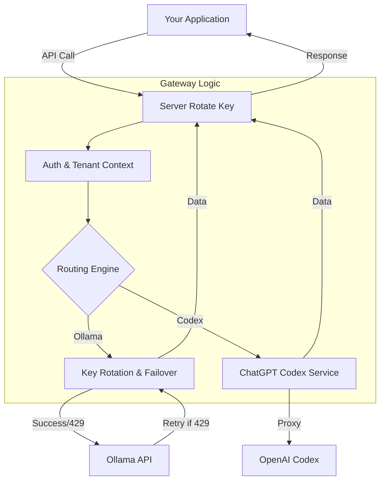

# 🚀 Server Rotate Key

**Server Rotate Key** is a high-performance, multi-tenant AI gateway designed to unify, optimize, and scale your interaction with multiple LLM providers. It acts as a resilient proxy layer that handles API key rotation for **Ollama** and seamless integration with **ChatGPT (Codex)**, ensuring high availability and comprehensive auditing for enterprise applications.

## 🌟 Key Features

- **🔄 Multi-Provider Engine**: Unified access to **Ollama** (pooled keys) and **ChatGPT Codex** backends through a single, consistent API.
- **⚡ Intelligent Key Rotation**: Automatically manages pools of API keys, distributing load and rotating keys to maximize throughput and avoid rate limits.
- **🛡️ Smart Failover**: Intercepts `429 Too Many Requests` errors and instantly retries using the next available key in the pool, ensuring maximum uptime.
- **🤖 Dynamic Injection**: Configure "Default Model" and "Default Provider" per tenant. If a client request omits these fields, the gateway injects your preferences automatically.
- **📊 Premium Analytics**: A state-of-the-art dashboard with real-time activity charts, success/failure metrics, and full audit logs for every request.
- **🔐 Enterprise Security**:
  - **System API Keys**: Dedicated keys for programmatic integration.
  - **Tenant Isolation**: Secure separation of data and configuration between users.
- **📖 Developer Portal**: Interactive API documentation and a built-in **Model Playground** for instant testing and debugging.

## 🏗️ Architecture

The gateway abstracts provider-specific logic, providing a resilient interface for your applications.



## 🛠️ Technology Stack

- **Backend**: [NestJS](https://nestjs.com/) (Node.js)
- **Frontend**: [React](https://reactjs.org/) + [Vite](https://vitejs.dev/)
- **Database**: [SQLite](https://www.sqlite.org/) + [Prisma ORM](https://www.prisma.io/)
- **Styling**: Vanilla CSS with Glassmorphism & Modern Aesthetics

## 🚀 Quick Start

### Prerequisites

- Node.js (v18+)
- npm or yarn

### Installation

1. **Clone the repository**:
   ```bash
   git clone https://github.com/Giuseph66/server-rotate-key.git
   cd server-rotate-key
   ```

2. **Setup the Backend**:
   ```bash
   cd backend
   npm install
   npm run db       # Initializes database and seeds default data
   npm run start:dev
   ```

3. **Setup the Frontend**:
   ```bash
   cd ../frontend
   npm install
   npm run dev
   ```

## 📖 Usage

Point your applications to the gateway instead of individual provider APIs.

**Example Request (Ollama Provider):**
```bash
curl http://localhost:3333/api/chat \
  -H "Authorization: Bearer YOUR_SYSTEM_KEY" \
  -H "Content-Type: application/json" \
  -d '{
    "provedor": "ollama",
    "model": "llama3.2", 
    "messages": [{ "role": "user", "content": "Explain quantum physics." }]
  }'
```
*Note: If `model` is omitted, the tenant's default model will be used.*

**Example Request (Codex Provider):**
```bash
curl http://localhost:3333/api/chat \
  -H "Authorization: Bearer YOUR_SYSTEM_KEY" \
  -H "Content-Type: application/json" \
  -d '{
    "provedor": "codex",
    "model": "GPT-5.5",
    "messages": [{ "role": "user", "content": "Write a python script." }]
  }'
```

## 📜 License

This project is licensed under the MIT License.
