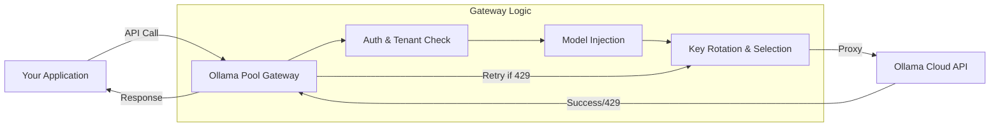

# 🚀 Ollama Pool Gateway

Ollama Pool Gateway is a high-performance, multi-tenant proxy designed to optimize and scale your interaction with the Ollama Cloud API. It provides a robust layer of abstraction that handles API key rotation, automatic failover, and comprehensive usage auditing.

## 🌟 Key Features

- **🔄 Intelligent Key Rotation**: Manage a pool of multiple Ollama Cloud API keys. The gateway automatically rotates keys to maximize throughput and avoid rate limits.
- **🛡️ Automatic Failover & Retries**: If a key hits a rate limit (HTTP 429) or fails, the gateway automatically retries the request using a different key from the pool, ensuring maximum uptime.
- **👥 Multi-Tenancy & Isolation**: Support for multiple tenants, each with their own isolated usage logs and settings.
- **🤖 Default Model Injection**: Configure a "Default Model" per tenant. If a client request omits the `model` field, the gateway automatically injects the preferred model before proxying to Ollama.
- **📊 Detailed Audit Logs**: Complete visibility into every API call. Track timestamps, endpoints, models used, latency, and full request/response bodies.
- **🔐 Flexible Authentication**: 
  - **System API Keys**: For seamless programmatic integration.
  - **JWT Auth**: For secure dashboard management.
- **🎮 Built-in Playground**: Test models directly from the admin dashboard with a modern chat interface.
- **📖 Integrated Documentation**: Dynamic API documentation that updates based on your active configuration.

## 🏗️ How it Works

The gateway acts as a smart middleman between your applications and the Ollama Cloud.



1.  **Auth**: Validates the request via JWT or System API Key.
2.  **Model Injection**: If `model` is missing, it looks up the tenant's default.
3.  **Rotation**: Selects the best available key (least used or round-robin).
4.  **Failover**: If Ollama returns a 429 (Rate Limit), the key is put in "cooldown" and the gateway immediately retries with a new key.
5.  **Logging**: The entire transaction is recorded for auditing and performance monitoring.

## 🛠️ Technology Stack

- **Backend**: [NestJS](https://nestjs.com/) (Node.js framework)
- **Frontend**: [React](https://reactjs.org/) + [Vite](https://vitejs.dev/)
- **Database**: [SQLite](https://www.sqlite.org/) with [Prisma ORM](https://www.prisma.io/)
- **Styling**: Vanilla CSS + Glassmorphism UI

## 🚀 Getting Started

### Prerequisites

- Node.js (v18+)
- npm or yarn

### Installation

1. **Clone the repository**:
   ```bash
   git clone https://github.com/Giuseph66/ollama-server-rotate-key.git
   cd ollama-server-rotate-key
   ```

2. **Setup the Backend**:
   ```bash
   cd backend
   npm install
   npx prisma migrate dev --name init
   npx prisma db seed
   npm run start:dev
   ```

3. **Setup the Frontend**:
   ```bash
   cd ../frontend
   npm install
   npm run dev
   ```

## 📖 Usage

### Using the Gateway

Simply point your Ollama clients to the gateway instead of the direct Ollama API.

**Example Request (with System API Key):**

```bash
curl http://localhost:3333/api/chat \
  -H "Authorization: Bearer YOUR_SYSTEM_KEY" \
  -d '{
    "messages": [{ "role": "user", "content": "Hello!" }]
  }'
```
*Note: If "model" is omitted, your configured default model will be used.*

### API Endpoints

- `POST /api/chat`: Proxy for Ollama Chat API.
- `POST /api/generate`: Proxy for Ollama Generation API.
- `GET /api/models`: List available models through the pool.
- `GET /api/usage/logs`: Access audit logs.

## 🔒 Security

- All API keys are stored securely.
- Tenant isolation ensures that one user cannot see the logs or keys of another.
- System API Keys provide a secure way to integrate without exposing dashboard credentials.

## 📜 License

This project is licensed under the MIT License.
