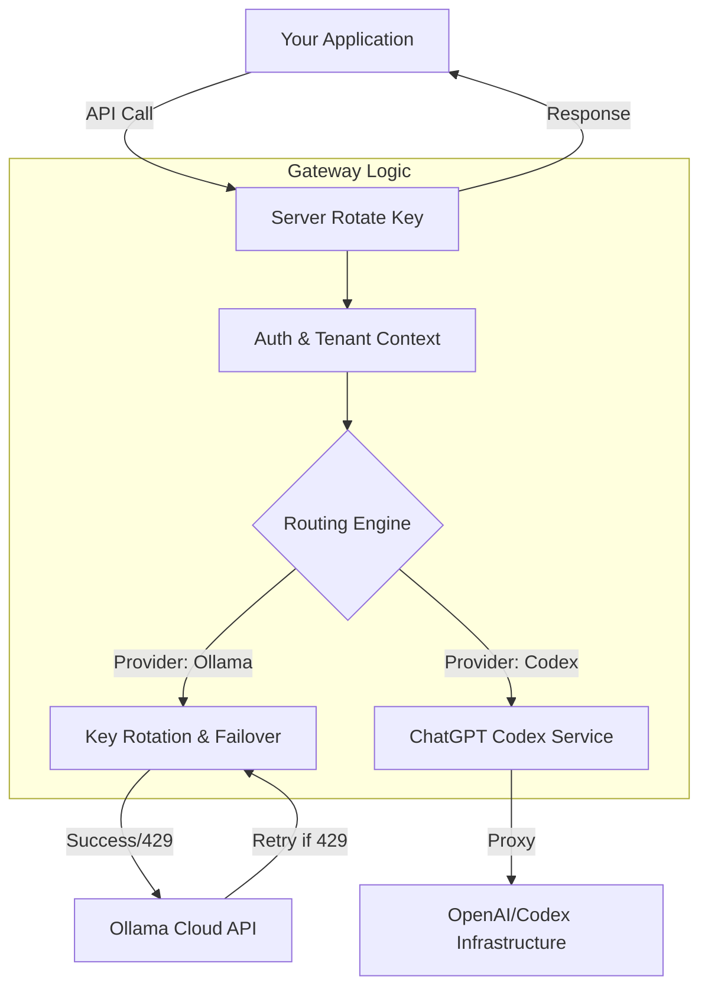

# 🚀 Server Rotate Key

**Server Rotate Key** is a high-performance, multi-tenant AI gateway designed to unify, optimize, and scale your interaction with multiple LLM providers. It acts as a resilient proxy layer that handles API key rotation for **Ollama Cloud** and seamless integration with **ChatGPT (Codex)**, ensuring high availability and comprehensive auditing for enterprise applications.

## 🌟 Key Features

- **🔄 Multi-Provider Engine**: Support for **Ollama Cloud** (pooled keys) and **ChatGPT Codex** (direct account connection) through a unified API.
- **⚡ Intelligent Key Rotation**: Automatically manages a pool of multiple API keys. The gateway distributes load and rotates keys to maximize throughput.
- **🛡️ Automatic Failover (Smart Retry)**: Intercepts rate limit errors (HTTP 429) from upstream providers and instantly retries with the next available key/connection.
- **🤖 Default Model & Provider Injection**: Configure a "Default Model" and "Default Provider" per tenant. Client requests can be as simple as sending messages—the gateway handles the rest.
- **📊 Premium Analytics Dashboard**: A state-of-the-art Glassmorphism dashboard with real-time activity charts, success/failure metrics, and detailed audit logs.
- **🔐 Enterprise Security**:
  - **System API Keys**: Secure programmatic integration without exposing account credentials.
  - **Tenant Isolation**: Complete separation of keys, logs, and settings between users.
- **📖 Developer Portal**: Dynamic, interactive API documentation and a built-in **Model Playground** for instant testing.

## 🏗️ Architecture

The gateway acts as an intelligent middleman, abstracting the complexity of multiple backends.



## 🛠️ Technology Stack

- **Backend**: [NestJS](https://nestjs.com/) (Node.js)
- **Frontend**: [React](https://reactjs.org/) + [Vite](https://vitejs.dev/)
- **Database**: [SQLite](https://www.sqlite.org/) + [Prisma ORM](https://www.prisma.io/)
- **Styling**: Vanilla CSS + Tailwind-inspired Modern UI (Glassmorphism)

## 🚀 Quick Start

### Prerequisites

- Node.js (v18+)
- npm or yarn

### Installation

1. **Clone the repository**:
   ```bash
   git clone https://github.com/Giuseph66/ollama-server-rotate-key.git
   cd ollama-server-rotate-key
   ```

2. **Setup the Backend**:
   ```bash
   cd backend
   npm install
   npx prisma migrate dev --name init
   npx prisma db seed
   npm run start:dev
   ```

3. **Setup the Frontend**:
   ```bash
   cd ../frontend
   npm install
   npm run dev
   ```

## 📖 Usage

Point your applications to the gateway instead of individual provider APIs.

**Example Request (Ollama with System Key):**
```bash
curl http://localhost:3333/api/chat \
  -H "Authorization: Bearer YOUR_SYSTEM_KEY" \
  -H "Content-Type: application/json" \
  -d '{
    "provedor": "ollama",
    "messages": [{ "role": "user", "content": "Explain quantum physics." }]
  }'
```

**Example Request (ChatGPT Codex):**
```bash
curl http://localhost:3333/api/chat \
  -H "Authorization: Bearer YOUR_SYSTEM_KEY" \
  -H "Content-Type: application/json" \
  -d '{
    "provedor": "codex",
    "model": "GPT-5.5",
    "messages": [{ "role": "user", "content": "Write a python script." }]
  }'
```

## 📜 License

This project is licensed under the MIT License.
